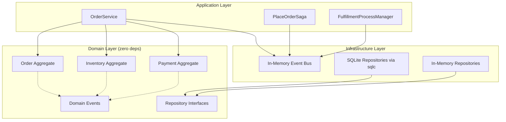

# DDD Sandbox — Plan

## Motivation

A didactic project for learning Domain-Driven Design concepts from "Learning Domain Driven Development" (Vlad Khononov). The goal is to implement each concept in a well-known domain, keeping the code as simple as possible while being complex enough to show why DDD is valuable.

## Domain: E-commerce Order Fulfillment

Chosen because:
- Universally understood (zero domain-specific learning cost)
- Naturally decomposes into multiple aggregates with clear invariants
- Saga and process manager patterns are clearly distinct (seconds vs. days)
- Extensible to cover the full DDD concept space as learning progresses

## Scope (through Chapter 9)

### Aggregates

| Aggregate | Root | Key Invariants |
|---|---|---|
| Order | `Order` | Immutable after confirmation, total = sum(items) |
| Inventory | `Product` | Stock >= 0, reservations tracked and bounded by available stock |
| Payment | `Payment` | Can't capture without authorization, refund <= captured amount |

### Saga: PlaceOrderSaga

Short-lived orchestrated transaction coordinating order placement:

```
ReserveInventory → AuthorizePayment → CapturePayment → ConfirmOrder
```

With compensating transactions on failure:
- Release inventory
- Void payment
- Cancel order

### Process Manager: FulfillmentProcessManager

Long-running state machine tracking order fulfillment:

```
WaitingForShipment → Shipped → Delivered → [ReturnWindowOpen] → Completed
```

With a 30-day return window timer (injectable clock for deterministic tests).

### Supporting Patterns

- Domain Events (plain structs, no framework)
- Repository pattern (interfaces in domain, implementations in infrastructure)
- In-memory event bus (synchronous, channel-free for determinism)
- Dependency inversion (domain has zero external imports)

## Architecture



## Tech Stack

| Tool | Purpose |
|---|---|
| Go 1.26.x | Language |
| `modernc.org/sqlite` | Pure-Go SQLite driver (no CGO) |
| sqlc | Type-safe query generation from SQL |
| goose | Schema migrations |
| testify | Test assertions |

## Growth Path (post-Chapter 9)

- HTTP layer with `net/http` (Go 1.22+ routing patterns)
- CQRS: separate read-model projections for order tracking
- Event sourcing on the Order aggregate
- Postgres migration (change sqlc driver + goose dialect)
- Bounded context extraction (separate Go modules)
- Outbox pattern for reliable event publishing
- Anti-corruption layer for external payment/shipping providers
